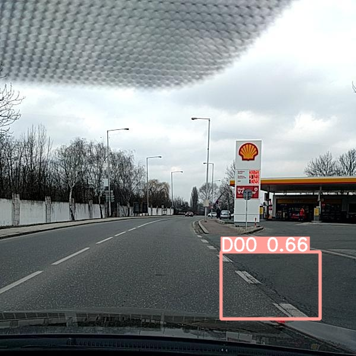
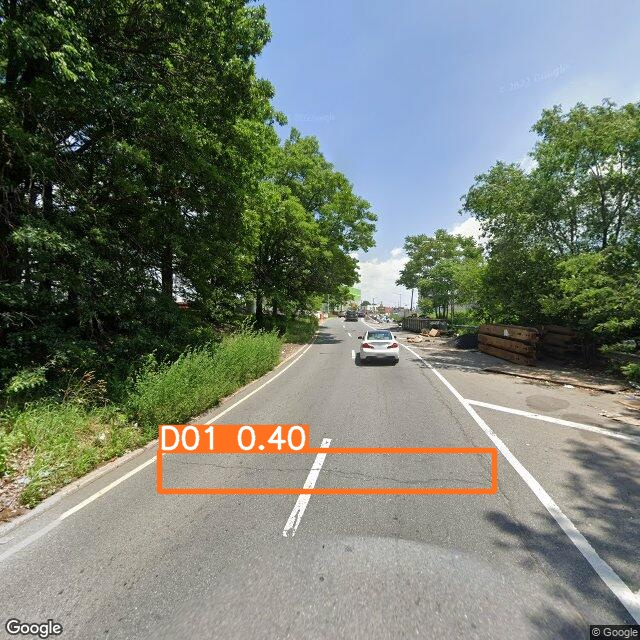
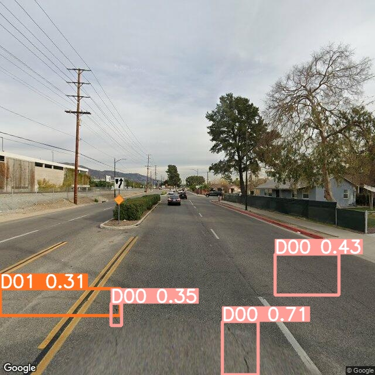
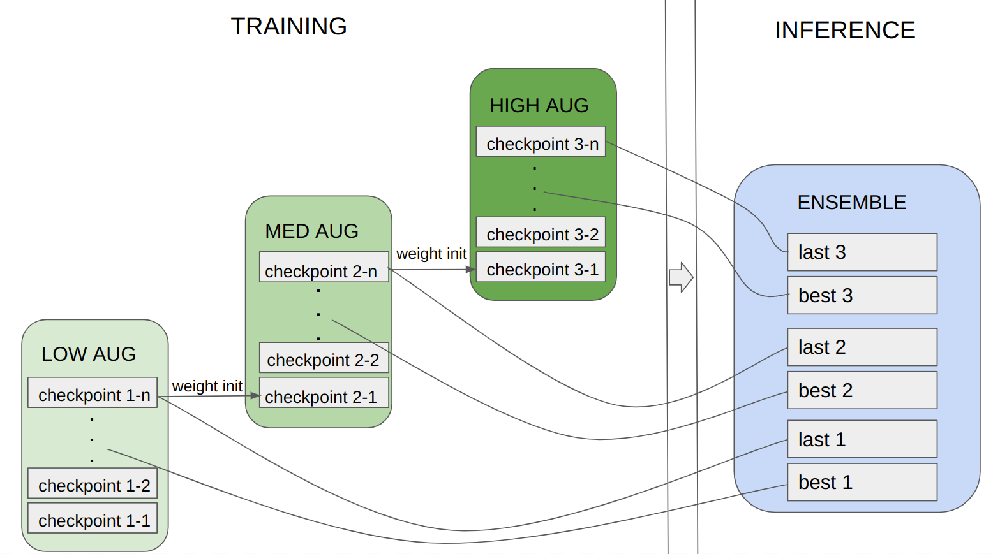

# RDCC2022 challenge solution 

This is a [RDC2022](https://crddc2022.sekilab.global/) challenge solution of kubapok.

Here are sample predictions:


   




This approach is based on training many models with different data augmentation settings. 
The next model weights are initialized by the previous one, as in the picture below. This allows creating
of an ensemble of large diversified models with no need for huge GPU resources.


   


## Model results

| Country       | F1-score |
|---------------|----------|
| India         | 0.42     |
| Japan         | 0.60     |
| Norway        | 0.38     |
| United States | 0.65     |
| all           | 0.60     |
| avarage       | 0.53     |


# How to use this repository


## Configuration

Install yolov5 (https://github.com/ultralytics/yolov5) in the home directory.

The dataset should be in yolo format (relative width and height in objects). Script `labels_to_jpg.py` may be used.

I used only 600 images for the validation dataset from the competition dataset, and the rest went for the training dataset.

Change paths to train the dataset in the first line in `cfg.yaml` file in each directory.

Change path in `--source` parameter in test file in `inference/2_prediction.sh`

Set test path variable `TEST_DIR` in `inference/3_create_sub.sh`


## Training

run:

```bash train.sh```


## Inference

run:

```bash inference.sh```

The prediction will appear in `inference/` directory.
